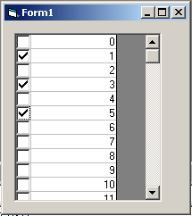



## CheckBox in MSFlexGrid

### Description

If you need to use a CheckBox in a Grid, you have 2 choices, either use the ListView control which is limited in it's ability to set different styles in it's cells, or you can use this little set of fuctions.

First build your Form, add a MSFlexGrid control, be sure to add the Microsoft FlexGrid Control from Project > Components. Add 2 PictureBox objects, these will contain the checked and unchecked images.
 
### More Info
 

             |
---                |---
**Submitted On**   |2002-10-22 16:05:46
**By**             |[mgfranz](https://github.com/Planet-Source-Code/PSCIndex/blob/master/ByAuthor/mgfranz.md)
**Level**          |Intermediate
**User Rating**    |4.5 (94 globes from 21 users)
**Compatibility**  |VB 6\.0
**Category**       |[Data Structures](https://github.com/Planet-Source-Code/PSCIndex/blob/master/ByCategory/data-structures__1-33.md)
**World**          |[Visual Basic](https://github.com/Planet-Source-Code/PSCIndex/blob/master/ByWorld/visual-basic.md)
**Archive File**   |[CheckBox\_i15033311252002\.zip](https://github.com/Planet-Source-Code/mgfranz-checkbox-in-msflexgrid__1-40094/archive/master.zip)

